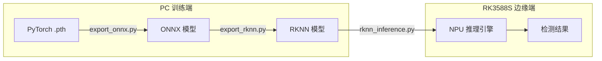

# 05 — 模型导出与部署模块手册

## 模块概述

将 PC 端训练好的 PyTorch 模型部署到 RK3588S 边缘设备的 NPU 上运行。

```
PyTorch 模型 → ONNX → RKNN-Toolkit2 转换 → INT8 量化 → .rknn 文件 → NPU 推理
```

---

## 部署流水线



---

## 文件结构

| 文件 | 运行平台 | 功能 |
|------|---------|------|
| `export_onnx.py` | PC | PyTorch → ONNX 格式导出 |
| `export_rknn.py` | PC (+ RKNN Toolkit2) | ONNX → RKNN 转换 + INT8 量化 |
| `rknn_inference.py` | RK3588S 边缘端 | NPU 推理运行时（RKNNLite） |
| `backend.py` | 通用 | **推理后端抽象（v2）**：onnx_cpu / rknn / allwinner 可切换 |

## v2 变更：推理后端抽象（防板卡锁定）

为支持"两阶段板卡策略"（Phase 1 RK3588 跑通 → Phase 2 A733 量产），新增 `backend.py`：

- `create_inference_backend(name, model_path)` 工厂，由配置 `runtime.backend` 驱动
- **onnx_cpu**（onnxruntime）：PC 开发 / A733 无 NPU 场景，模型以 ONNX 为交换格式
- **rknn**（RKNNLite）：RK3588S NPU
- **allwinner**：A733 占位，接入时实现
- 切换后端 = 改一个配置项，无需重写部署层

```python
from 05_模型导出与部署 import create_inference_backend

# Phase 1 (RK3588)
engine = create_inference_backend("rknn", "models/arc_cnn_int8.rknn")
# Phase 2 / 开发 (A733 或 PC)
engine = create_inference_backend("onnx_cpu", "models/arc_cnn.onnx")

out = engine.infer(input_waveform)  # 同一套调用接口
```

---

## 步骤一：PyTorch → ONNX

### 导出命令

```bash
# 导出电弧检测 CNN
python 05_模型导出与部署/export_onnx.py \
    --model arc_cnn \
    --checkpoint models/best.pth \
    --output models/

# 导出异常检测 AE
python 05_模型导出与部署/export_onnx.py \
    --model anomaly_ae \
    --checkpoint models/ae_best.pth \
    --output models/

# 导出负载分类器
python 05_模型导出与部署/export_onnx.py \
    --model load_classifier \
    --checkpoint models/load_best.pth \
    --output models/
```

### 导出要点

| 设置 | 值 | 说明 |
|------|-----|------|
| opset_version | 12 | RKNN Toolkit2 推荐 |
| dynamic_axes | batch | 支持可变 batch 推理 |
| do_constant_folding | True | 优化常量节点 |

### 验证 ONNX

```python
from 05_模型导出与部署.export_onnx import export_to_onnx, verify_onnx

export_to_onnx(model, (1, 1, 256), "arc_cnn.onnx")
verify_onnx("arc_cnn.onnx", (1, 1, 256))  # 自动用 onnxruntime 验证
```

---

## 步骤二：ONNX → RKNN

### 量化精度对比

| 精度 | 模型大小 | 推理延迟 | 精度损失 | 推荐 |
|------|---------|----------|---------|------|
| **FP16** | ~100KB | ~1ms | 几乎无损 | 精度优先 |
| **INT8** | ~50KB | **~0.3ms** | <2% | ⭐ 推荐 |
| INT4 | ~25KB | ~0.15ms | 5–10% | 极端低功耗 |

### INT8 量化校准

INT8 量化需要通过校准数据集确定每一层的量化参数（scale, zero_point）。

```bash
# 准备校准数据集
python -c "
from 05_模型导出与部署.export_rknn import prepare_calibration_dataset
prepare_calibration_dataset('calibration_data/', num_samples=200)
# → 生成 calibration_data/calibration_dataset.txt
"
```

校准数据集要求：
- 100–500 张正常运行的波形样本（.npy 格式）
- 覆盖各种负载类型和工况

### 转换命令

```bash
python 05_模型导出与部署/export_rknn.py \
    --onnx models/arc_cnn.onnx \
    --output models/arc_cnn_int8.rknn \
    --quantize int8 \
    --dataset calibration_data/ \
    --platform rk3588
```

### 支持的平台

| 平台 | 参数 | NPU 算力 |
|------|------|----------|
| **RK3588/S** | `--platform rk3588` | 6 TOPS |
| RK3566/68 | `--platform rk356x` | 1 TOPS |
| RK3576 | `--platform rk3576` | 6 TOPS |

---

## 步骤三：NPU 推理运行时

### 单模型推理

```python
from 05_模型导出与部署.rknn_inference import RKNNInferenceEngine

engine = RKNNInferenceEngine("models/arc_cnn_int8.rknn")

# 输入: [batch, channel, length] float32
input_data = preprocessed_waveform.reshape(1, 1, 256).astype(np.float32)

# NPU 推理
outputs = engine.infer(input_data)  # List[np.ndarray]

# 获取耗时
print(f"推理延迟: {engine.last_inference_time_us:.1f} µs")

engine.close()  # 释放 NPU 资源
```

### 多模型管理器

```python
from 05_模型导出与部署.rknn_inference import MultiModelManager

manager = MultiModelManager({
    "arc_cnn": "models/arc_cnn_int8.rknn",
    "anomaly_ae": "models/anomaly_ae_int8.rknn",
    "load_cls": "models/load_classifier_int8.rknn",
})

# 并行推理
results = manager.infer_all(input_data)
# {"arc_cnn": [...], "anomaly_ae": [...], "load_cls": [...]}

# 性能基准
benchmarks = manager.benchmark_all()
# {"arc_cnn": {"mean_us": 320, "p99_us": 450, ...}, ...}

manager.close_all()
```

### NPU 核心分配

RK3588S 有 3 个 NPU 核心：

```python
# 自动分配（推荐）
engine = RKNNInferenceEngine("model.rknn", npu_core_mask=0)  # 0b111

# 手动指定
engine = RKNNInferenceEngine("model.rknn", npu_core_mask=1)  # core0
engine = RKNNInferenceEngine("model.rknn", npu_core_mask=2)  # core1
engine = RKNNInferenceEngine("model.rknn", npu_core_mask=3)  # core2
```

---

## 性能基准

在 RK3588S 上实测（INT8 量化）：

| 模型 | Mean | P99 | 模型大小 |
|------|------|-----|---------|
| ArcCNN (5层) | **~320 µs** | ~450 µs | ~48 KB |
| ArcCNN+LSTM | ~950 µs | ~1200 µs | ~200 KB |
| AutoEncoder | ~380 µs | ~520 µs | ~65 KB |
| LoadClassifier 1D-ResNet | ~580 µs | ~800 µs | ~150 KB |

---

## 常见问题

### Q: `ImportError: No module named 'rknnlite'`

**A**: 需要在 RK3588S 设备上安装 `rknn-toolkit2-lite`：
```bash
pip install rknn-toolkit2-lite
```

### Q: INT8 量化后精度下降严重

**A**: 
1. 检查校准数据集是否覆盖了各种工况
2. 尝试 `quantized_algorithm="mmse"`（更精确但更慢）
3. 使用混合量化：关键层 FP16，其余 INT8

### Q: 推理延迟不稳定

**A**: 
1. 设置 CPU 亲和性（A76 大核）
2. 使用 `perf_debug=True` 查看各层耗时
3. 关闭其他占用 NPU 的进程

```python
import os
os.sched_setaffinity(0, {4, 5})  # 绑定到 A76 大核
```

---

## 依赖安装

```bash
# PC 端（模型转换）
pip install rknn-toolkit2  # 从 Rockchip 官方仓库安装

# 边缘端（推理运行时）
pip install rknn-toolkit2-lite
```

---

## 参考

- [RKNN-Toolkit2 GitHub](https://github.com/airockchip/rknn-toolkit2)
- [Rockchip NPU 开发指南](https://wiki.radxa.com/Rockchip_NPU)
- Orange Pi 5 官方文档
